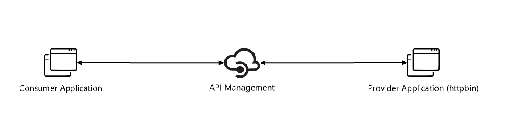

# ais-apim-snippets

## Build Status

| GitHub Action | Status |
| ----------- | ----------- |
| Build | [](https://github.com/pascalvanderheiden/ais-apim-snippets/actions/workflows/build.yml) |
| Release | [](https://github.com/pascalvanderheiden/ais-apim-snippets/actions/workflows/release.yml) |

## About

This is a collection of snippets to use with the [Azure API Management](https://docs.microsoft.com/en-us/azure/api-management/overview) service.

Over time I've developed so many snippets for Azure API Management, but never stored them in a central place. This is why I created this repository.

I also wanted to make it easy to test and deploy them in an automated way, that is why I've added the GitHub Actions to do this repository.

The API Management Product Team already created a very useful set of [snippets](https://github.com/Azure/api-management-policy-snippets), but I wanted to make it easy to use and deploy them. I've added the VSCode snippets file from the above repository to this VSCode project. This makes it a lot easier to create your policies from VSCode. Follow [this instruction](https://code.visualstudio.com/docs/editor/userdefinedsnippets#_create-your-own-snippets) to create your own snippets or use this one with other projects. 

For deployment I choose to do it all in Bicep templates. I got most of my examples from [here](https://github.com/Azure/bicep/tree/main/docs/examples).

Hope you find this useful!

## Architecture



## Prerequisites

* Install [Visual Studio Code](https://code.visualstudio.com/download)
* Install [REST Client](https://marketplace.visualstudio.com/items?itemName=humao.rest-client) Extension for Visual Studio Code.
* Install Chocolatey (package manager)

```ps1
Set-ExecutionPolicy Bypass -Scope Process -Force; [System.Net.ServicePointManager]::SecurityProtocol = [System.Net.ServicePointManager]::SecurityProtocol -bor 3072; iex ((New-Object System.Net.WebClient).DownloadString('https://community.chocolatey.org/install.ps1'))
```

* Install Bicep CLI

```ps1
choco install bicep
```

* Install Az Module in PowerShell

```ps1
Install-Module -Name Az -AllowClobber -Scope CurrentUser
```

## Deploy Manually

* Git Clone the repository

```ps1
git clone https://github.com/pascalvanderheiden/ais-apim-snippets.git
```

* Deploy it all by one script

I've included all the steps in 1 Powershell script. This will create all the needed resources. Keep in mind that this will take a while to deploy.

I've used these variables:

```ps1
$subscriptionId = "<subscription_id>"
$namePrefix = "<project_prefix>"

# For removing soft-delete
$apimName = "<apim_name>"
```

```ps1
.\deploy\manual-deploy.ps1 -subscriptionId $subscriptionId -namePrefix $namePrefix
```

* Remove the APIM Soft-delete

If you deleted the deployment via the Azure Portal, and you want to run this deployment again, you might run into the issue that the APIM name is still reserved because of the soft-delete feature. You can remove the soft-delete by using this script:

```ps1
.\deploy\del-soft-delete-apim.ps1 -subscriptionId $subscriptionId -apimName $apimName
```

* Testing

I've included a tests.http file with relevant Test you can perform, to check if your deployment is successful.

## Deploy with Github Actions

* Fork this repository

* Generate a Service Principal

```ps1
az ad sp create-for-rbac -n <name_sp> --role Contributor --sdk-auth --scopes /subscriptions/<subscription_id>
```

Copy the json output of this command.

* Update GitHub Secrets for customizing your deployment

In the repository go to 'Settings', on the left 'Secrets', 'Actions'.
And pass the json output in the command used above into the secret 'AZURE_CREDENTIALS'.

The following secrets need to be created:

* AZURE_CREDENTIALS
* AZURE_SUBSCRIPTION_ID
* LOCATION
* PREFIX

### Commit

Commit the changes, and this will trigger the CI Build Pipeline.